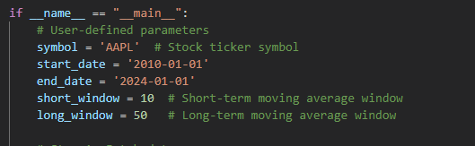

# ma-crossover-algo

An algorithmic project that I'm currently working on!

Makes use of Simple Moving Average Crossover Strategy to generate buy and sell signals.

Future Implementations:
1. UI for user to input in desired ticker symbol, start and end date, short and long term window.

2. Backtesting of multiple stocks.

3. Implementation of parameter optimisation to find out best performing SMA and LMA time windows for different stocks and time periods.

4. Benchmarking against an index (S&P 500) to compare its relative performance.

To use the interactive UI, follow these steps:

1. **Install Required Libraries**:
    Ensure you have the necessary libraries installed. You can install them using pip:
    ```bash
    pip install pandas numpy matplotlib ipywidgets
    ```

2. **Run the Jupyter Notebook**:
    Open the Jupyter Notebook and run the cells. You will see interactive widgets for inputting the ticker symbol, start date, end date, short window, and long window.

3. **Input Desired Values**:
    Use the widgets to input your desired values. The plot will update automatically based on your inputs.



For current version, to analyse other stocks and dates, please change variables to desired stock and dates as shown in the screenshot below.